# **Delight Restaurant**

Delight Restaurant is a restaurant booking site that is intended to showcase the restaurant, book reservations for the restaurant and handle interactions between customers and staff members. Customers can see information about the restaurant and its menu as well as book reservations while staff members can interact with reservations to approve or decline among other things.

The live site can be viewed [here](https://delight-restaurant-3f0223201abb.herokuapp.com/).

## Planning:
### Site aims
The purpose of this fictional restaurant website project was to create an interactive and user-friendly online platform for a restaurant. The website aims to provide customers with a seamless experience for exploring the restaurant's offerings, making reservations, and managing their personal accounts. Through this project, I focused on building a robust system that includes features like menu browsing, table booking, and user authentication, ensuring that customers can easily navigate and use the site.

Additionally, the project includes features for the restaurant staff to manage the menu efficiently. Staff members can add, edit, and delete menu items, ensuring that the online menu is always up-to-date with the latest offerings. This helps streamline the restaurant's operations and ensures that customers receive timely and accurate information. Overall, the project aims to bridge the gap between traditional dining and modern digital conveniences, enhancing the dining experience for both customers and staff, while also serving as an educational exercise in developing a functional web application for me.

## User Experience
Planning the project was a crucial step in ensuring its success and functionality. I began by defining the primary objectives and features that the restaurant website should have, focusing on creating an intuitive user experience for both customers and staff. To organise the development process, I created seven Epics in GitHub, each representing a major component or feature set of the project. This structured approach allowed me to break down the project into manageable parts and ensure that all aspects were thoroughly addressed. Each Epic was further broken down into detailed user stories, which described specific functionalities from the perspective of different types of users. These Epics and user stories can be found in the [project kanban board](https://github.com/users/Faysal-Ahmed-Aweys/projects/6/) or [Project issues](https://github.com/Faysal-Ahmed-Aweys/Delight-Restaurant-/issues). The Epics be viewed below:

### Epics
1. [Initial Django Setup](https://github.com/Faysal-Ahmed-Aweys/Delight-Restaurant-/issues/1)
2. [User Account Management](https://github.com/Faysal-Ahmed-Aweys/Delight-Restaurant-/issues/2)
3. [User Reservation Management](https://github.com/Faysal-Ahmed-Aweys/Delight-Restaurant-/issues/3)
4. [Site Content Interaction](https://github.com/Faysal-Ahmed-Aweys/Delight-Restaurant-/issues/4)
5. [Staff Reservation Management](https://github.com/Faysal-Ahmed-Aweys/Delight-Restaurant-/issues/5)
6. [User Menu Interaction](https://github.com/Faysal-Ahmed-Aweys/Delight-Restaurant-/issues/6)
7. [Staff Menu Management](https://github.com/Faysal-Ahmed-Aweys/Delight-Restaurant-/issues/7)

### Site Structure

#### Wireframes
I created wireframes of how I wanted the site to look using [Balsamiq](https://balsamiq.com/). I created a wireframe for each main page layout and used it as a guide when structuring my site. Although the site contains other pages, the layout is mostly the same and therefore I adopt their structure from these main wireframes.

I decided to make wireframes only for larger screens as I used a column-based layout which meant the content would look more or less the same and would just be pushed down for smaller devices.

The final site pages are a bit different from the original wireframes.. I knew how I wanted the site to be structured and made wireframes to reflect my ideas so that I could use them as a guide when developing different pages. The main layout is the same but small details differ from page to page due to decisions made during development in order to maintain good functionality and presentation. Links to the wireframes can be found below:

* [Home page](assets/docs/wireframes/home.png)
* [Menu page](assets/docs/wireframes/menu.png)
* [Profile page](assets/docs/wireframes/profile.png)
* [Login page](assets/docs/wireframes/login.png)
* [Signup page](assets/docs/wireframes/signup.png)
* [Staff dashboard page](assets/docs/wireframes/staff_dashboard.png)
* [Reservations Management page](assets/docs/wireframes/reservations_management.png)
* [Reserving page](assets/docs/wireframes/reservations.png)
* [Menu Management page](assets/docs/wireframes/menu_management.png)
* [Menu Modal](assets/docs/wireframes/menu_modal.png)

#### Database Schema

### Site Design

#### Colour Scheme

#### Typography

### Project Management

## Features

### Existing Features

#### Current features common to all pages

* ##### Header

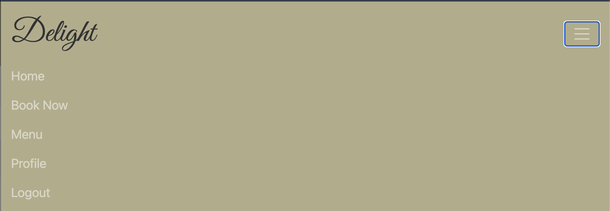

* ##### The Footer

#### Home Page
* ##### Hero Section

* ##### About us and Menu Section

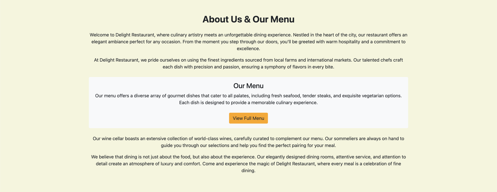

* ##### Testimonials Section

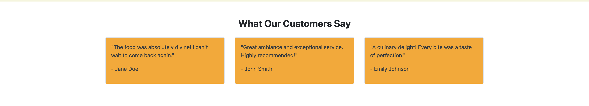

#### Menu Page

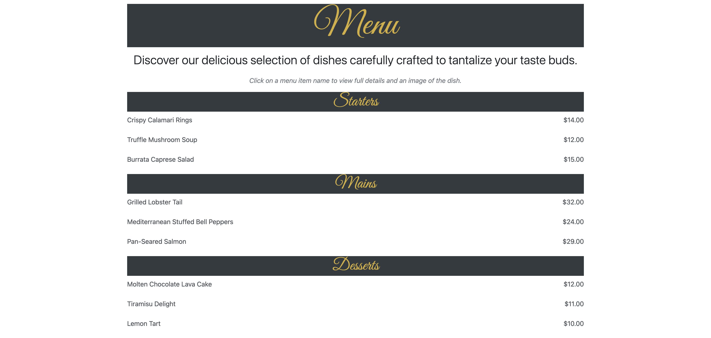

* ##### Menu Item Modal

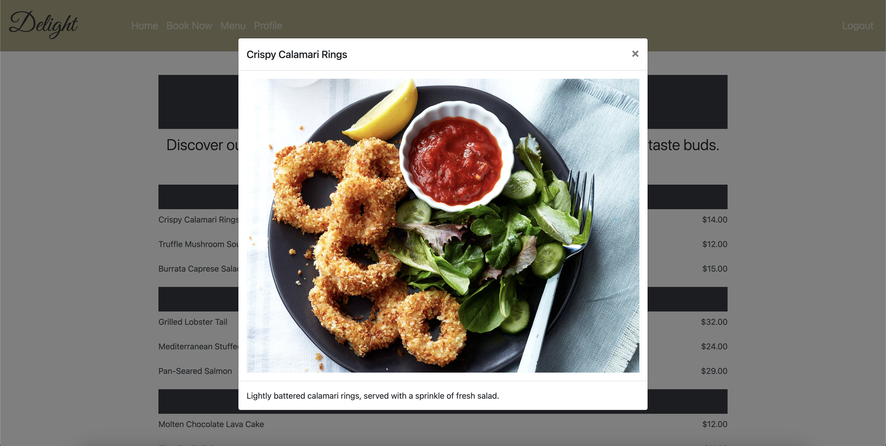

#### User Permissions

#### User Account Creation

* ##### Signup Page

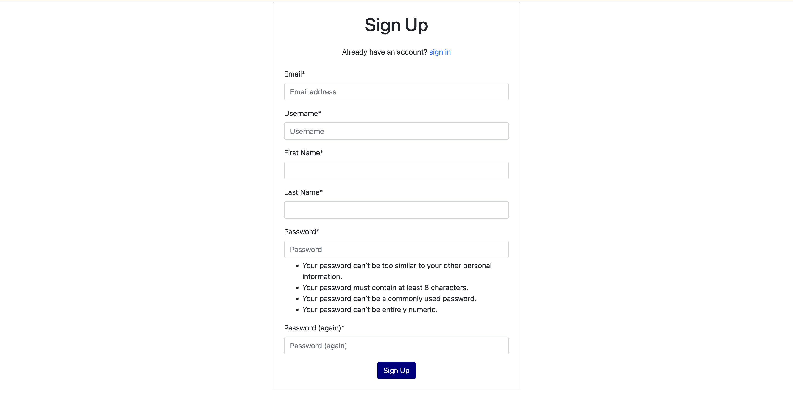

#### User login and logout

* ##### Login Page

* ##### Logout Page

#### Registered User Change Password

* ##### Change Password page

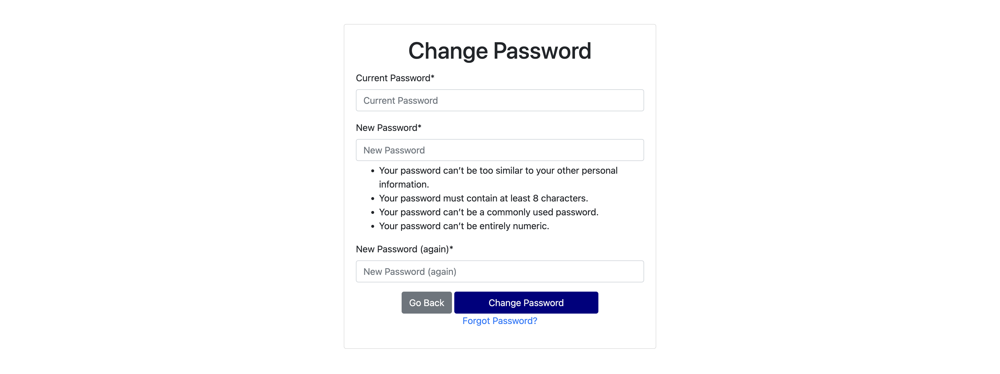

#### Booking Page

#### Editing Reservations

* ##### Edit Reservation Page

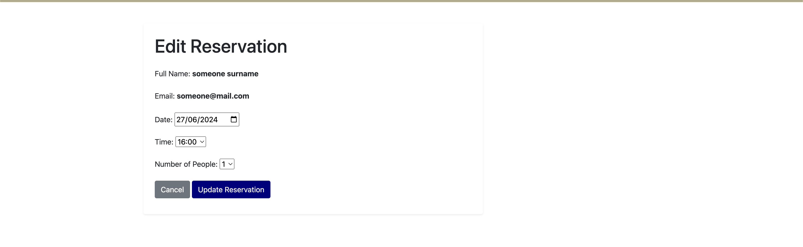

#### Canceling Reservations

* ##### Cancel Reservation Page

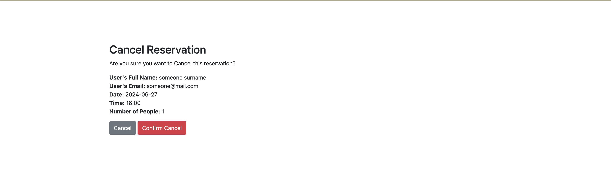

#### Deleting Expired Reservations

* ##### Delete Reservation Page

#### Profile Page

* ##### User Account Section.

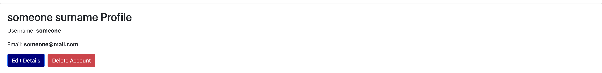

* ##### Reservations Section.

  * ###### Upcoming Reservations.
 
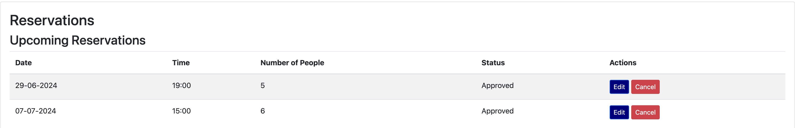

  * ###### Expired Reservations.

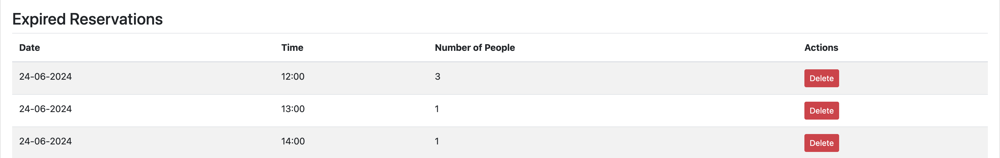

#### Editing User Account

* ##### Edit Account Page

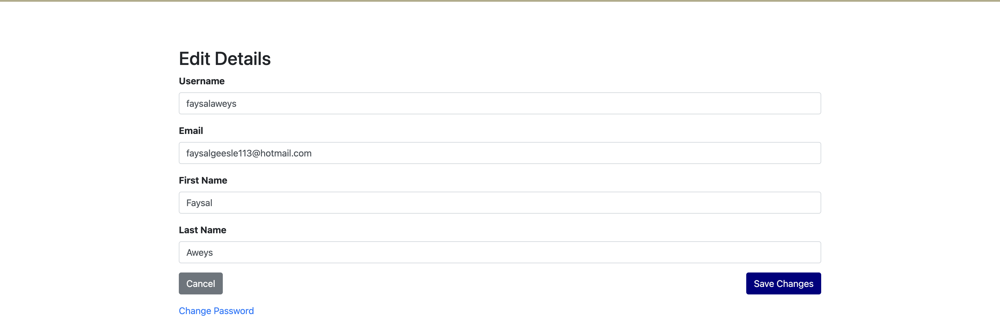

#### Deleting User Account

* ##### Delete Account Confirmation Page

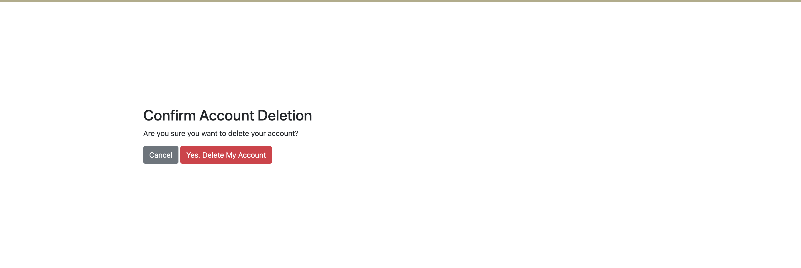

#### Staff Dashboard Page

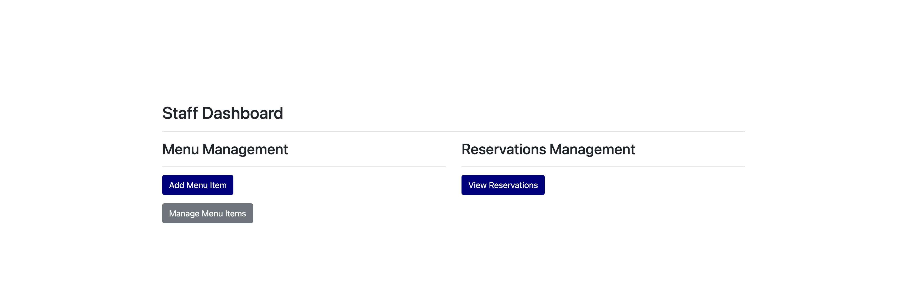

#### Add Menu item Page

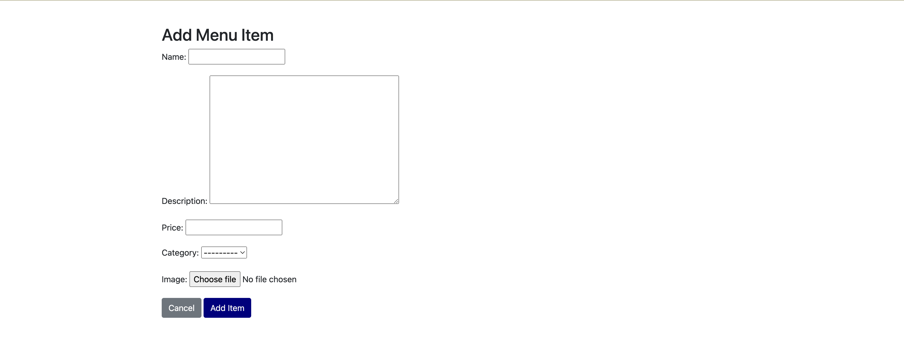

#### Menu Management Page

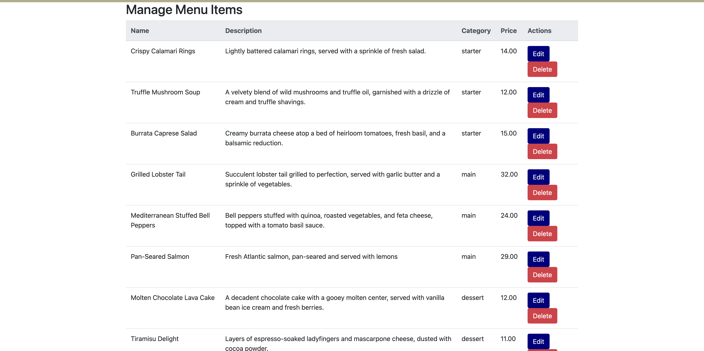

#### Reservations Management Page

#### Success messages

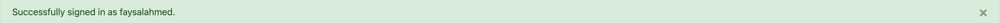
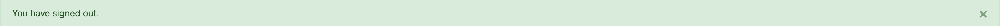

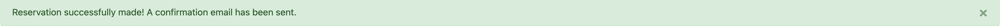

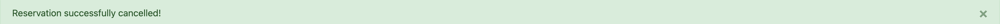

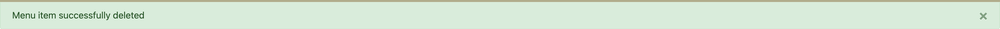
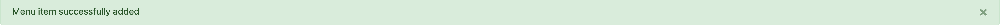
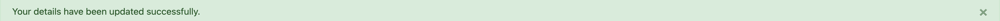
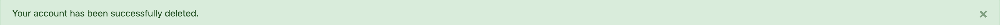

#### warning message

### Future Features and enhancements

## Technologies Used

## Python Packages Used

## Testing

## Deployment

## Credits

### Honourable Mentions

### General reference

### Content

### Media and Design
