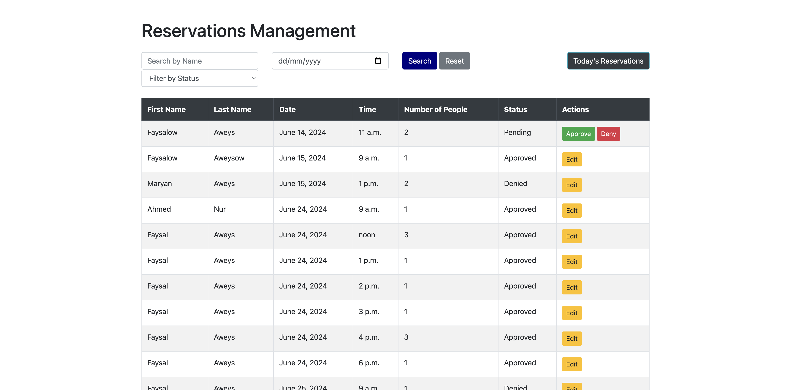
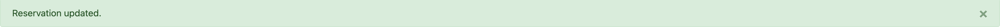

# **Delight Restaurant**

Delight Restaurant is a restaurant booking site that is intended to showcase the restaurant, book reservations for the restaurant and handle interactions between customers and staff members. Customers can see information about the restaurant and its menu as well as book reservations while staff members can interact with reservations to approve or decline among other things.

The live site can be viewed [here](https://delight-restaurant-3f0223201abb.herokuapp.com/).

## Planning:
### Site aims
The purpose of this fictional restaurant website project was to create an interactive and user-friendly online platform for a restaurant. The website aims to provide customers with a seamless experience for exploring the restaurant's offerings, making reservations, and managing their personal accounts. Through this project, I focused on building a robust system that includes features like menu browsing, table booking, and user authentication, ensuring that customers can easily navigate and use the site.

Additionally, the project includes features for the restaurant staff to manage the menu efficiently. Staff members can add, edit, and delete menu items, ensuring that the online menu is always up-to-date with the latest offerings. This helps streamline the restaurant's operations and ensures that customers receive timely and accurate information. Overall, the project aims to bridge the gap between traditional dining and modern digital conveniences, enhancing the dining experience for both customers and staff, while also serving as an educational exercise in developing a functional web application for me.

## User Experience
Planning the project was a crucial step in ensuring its success and functionality. I began by defining the primary objectives and features that the restaurant website should have, focusing on creating an intuitive user experience for both customers and staff. To organise the development process, I created seven Epics in GitHub, each representing a major component or feature set of the project. This structured approach allowed me to break down the project into manageable parts and ensure that all aspects were thoroughly addressed. Each Epic was further broken down into detailed user stories, which described specific functionalities from the perspective of different types of users. These Epics and user stories can be found in the [project kanban board](https://github.com/users/Faysal-Ahmed-Aweys/projects/6/) or [Project issues](https://github.com/Faysal-Ahmed-Aweys/Delight-Restaurant-/issues). The Epics be viewed below:

### Epics
1. [Initial Django Setup](https://github.com/Faysal-Ahmed-Aweys/Delight-Restaurant-/issues/1)
2. [User Account Management](https://github.com/Faysal-Ahmed-Aweys/Delight-Restaurant-/issues/2)
3. [User Reservation Management](https://github.com/Faysal-Ahmed-Aweys/Delight-Restaurant-/issues/3)
4. [Site Content Interaction](https://github.com/Faysal-Ahmed-Aweys/Delight-Restaurant-/issues/4)
5. [Staff Reservation Management](https://github.com/Faysal-Ahmed-Aweys/Delight-Restaurant-/issues/5)
6. [User Menu Interaction](https://github.com/Faysal-Ahmed-Aweys/Delight-Restaurant-/issues/6)
7. [Staff Menu Management](https://github.com/Faysal-Ahmed-Aweys/Delight-Restaurant-/issues/7)

### Site Structure

#### Wireframes
I created wireframes of how I wanted the site to look using [Balsamiq](https://balsamiq.com/). I created a wireframe for each main page layout and used it as a guide when structuring my site. Although the site contains other pages, the layout is mostly the same and therefore I adopt their structure from these main wireframes.

I decided to make wireframes only for larger screens as I used a column-based layout which meant the content would look more or less the same and would just be pushed down for smaller devices.

The final site pages are a bit different from the original wireframes.. I knew how I wanted the site to be structured and made wireframes to reflect my ideas so that I could use them as a guide when developing different pages. The main layout is the same but small details differ from page to page due to decisions made during development in order to maintain good functionality and presentation. Links to the wireframes can be found below:

* [Home page](assets/docs/wireframes/home.png)
* [Menu page](assets/docs/wireframes/menu.png)
* [Profile page](assets/docs/wireframes/profile.png)
* [Login page](assets/docs/wireframes/login.png)
* [Signup page](assets/docs/wireframes/signup.png)
* [Staff dashboard page](assets/docs/wireframes/staff_dashboard.png)
* [Reservations Management page](assets/docs/wireframes/reservations_management.png)
* [Reserving page](assets/docs/wireframes/reservations.png)
* [Menu Management page](assets/docs/wireframes/menu_management.png)
* [Menu Modal](assets/docs/wireframes/menu_modal.png)

#### Database Schema
I used Django's built-in User Model for user accounts and created two custom models for reservations and the menu for this project. The reservation model is linked to the user model via a foreign key. To enhance the user experience, I set up the system to automatically fill in users' personal details from their user account information when making a reservation. Additionally, I created a separate model for storing menu items.

The database schema shown below was designed using DrawSql.app. Due to limitations in the app, some field types could not be labeled correctly, as there was no option to override the available types. As a result, some fields used in the app models, such as cloudinary and email fields, are not included. Nevertheless, the diagram still shows the general layout of the models. The actual field choices are accurately reflected in the models within the project apps.

### Site Design

#### Colour Scheme
I used [Constras-grid](https://contrast-grid.eightshapes.com/) to choose colors that contrast well with each other and do not cause any contrast issues to the user whatsoever. The colors was suggested to me by my sister Maryan Aweys. They are the perfect colors for this site as they give the website cool, fancy and professional look and do not cause any contrast errors. 

#### Typography
As i was going for a professional fancy looking restaurant, i used the google font great vibes on the restaurant logo and name on hero section of the site which has given it a fancy look and alongside on the rest of the site, i used sans serif font which is neat and easy to read.

### Project Management
Throughout this project, I employed agile methodology by utilizing GitHub projects and issues. I could create epics and user stories using issues, labeling, and categorizing them. These issues were then added to the project kanban board, allowing me to efficiently manage the development process. This approach was extremely beneficial for breaking down the development process into distinct sections and stages, enhancing overall development efficiency and quality. agile principles helped me track my progress in every aspect and ensured that the site could be easily maintained in the future.

## Features

### Existing Features

#### Current features common to all pages

* ##### Header
The header is fixed and includes navbar with links to ease the navigation to different pages by the user. 

* ##### The Footer
The footer contains opening times, contact and address which are fictional and the social links do not take you to any pages that are related to the content of the website as the restaurant site is completely fictional and for educational purposes. I included these links to give my website some structure and to implement my skills. A short statement that states the purpose of the website is also included on the footer. 

#### Home Page
* ##### Hero Section
The Hero section includes Restaurant name, a quick link to booking page and a fictional restaurant hero image. I mentioned the websites i got the image from in the credits section.

* ##### About us and Menu Section

* ##### Testimonials Section

#### Menu Page
The menu page showcases the restaurant offerings. Full details of the menu item can will be displayed in a modal when a user clicks on the item. This makes sure the page remains clean and customers can still view full details.

* ##### Menu Item Modal

#### User Permissions

#### User Account Creation

Users can create accounts.

* ##### Signup Page

#### User login and logout

Registered users can login and logout.

* ##### Login Page

* ##### Logout Page

#### Registered User Change Password

Registered users can change their passwords.

* ##### Change Password page

#### Booking Page

The booking page contains a form that helps the user reserve a table for a certain date, time and for a certain number of people. only registered non staff members can visit this page. if staff members try to visit they are redirected to staff dashboard with a message that they are not authorised to view that page.

#### Editing Reservations

Registered users can edit their booked reservations. 

* ##### Edit Reservation Page

#### Canceling Reservations

Registered users can cancel their booked reservations. 

* ##### Cancel Reservation Page

#### Deleting Expired Reservations

Registered users can delete their expired reservations. 

* ##### Delete Reservation Page

#### Profile Page
The profile page is divided into 2 sections, one which shows user accout information and buttons to perform crud operations on their user accounts and another which shows upcoming and expired reservations. 

* ##### User Account Section.

* ##### Reservations Section.

  * ###### Upcoming Reservations.
 

  * ###### Expired Reservations.

#### Editing User Account

Registered users can edit their user account details.

* ##### Edit Account Page

#### Deleting User Account

Registered users can delete their user account details.

* ##### Delete Account Confirmation Page

#### Staff Dashboard Page

A staff dashboard is included in the project. When staff members login they are immediately redirected into this page. if they try to access home  page they are redirected or booking page, they are redirected with a message that they are not authorised to view that page.

#### Add Menu item Page

Staff members can add menu items to be viewed by customers.

#### Menu Management Page

Staff members can manage menu items and can perform crud operations on them.

#### Reservations Management Page

Staff members can manage reservations booked by customers by either approving or denying the reservation.

#### Success messages

#### warning message

### Future Features and enhancements

## Technologies Used
* [Balsamiq](https://balsamiq.com/wireframes/)
    * Used to create the wireframes during the planning stage of the project.
* [HTML5](https://html.spec.whatwg.org/)
    * Used to create structure and content for the site.
* [CSS](https://www.w3.org/Style/CSS/Overview.en.html)
    * Used to add custom styles to the HTML.
* [Django](https://www.djangoproject.com/)
    * The python framework used to develop the site.
* [Bootstrap](https://getbootstrap.com/)
    * The CSS framework used to develop the site.
* [Python](https://en.wikipedia.org/wiki/Python_(programming_language))
    * Used to provide functionality to the site.
* [JavaScript](https://www.javascript.com/)
    * Used to enhance functionality and interactivity.
* [Cloudinary](https://cloudinary.com/)
    * Used to host media files.
* [ElephantSQL](https://www.elephantsql.com/)
    * Used to host the database used for the site in production.
* [Gitpod](https://www.gitpod.io/#get-started)
    * Used to create code/content and file structure for the respository.
* [GitHub](https://github.com/)
    * Used to store the repository.

## Python Packages Used

The packages installed for the is project can be found in [the requirements.txt](requirements.txt)

## Testing

## Deployment

The project was deployed using [Heroku](https://heroku.com).

NB - to ensure a successful deployment of the project in Heroku, you need to ensure that you create a Procfile and a requirements.txt file.

Once you are certain that everything is ready to deploy the repo, you can do so through the following steps.

1. Log in to Heroku or create an account if necessary.
2. Click on the button labeled "New" from the dashboard in the top right corner and select the "Create new app" option in the drop-down menu.
3. Enter a unique name for the application and select the region you are in.
    * For this project, the unique name is "bundu-restaurant" and the region selected is Europe.
4. Click on "create app".
5. Navigate to the settings tab and click "Reveal config vars".
6. Add the config vars necessary for the project.
7. Navigate to the "Deploy" section by clicking the "Deploy" tab in the navbar.
8. Select "GitHub" as the deployment method and click "Connect to GitHub".
9. Search for the GitHub repository that you wish to deploy.
10. Click on "connect" to link the repository to Heroku.
11. Scroll down and click on "Deploy Branch" to manually deploy.
12. Once the app has deployed successfully, Heroku will notify you and provide a button to view the app.

NB - If you wish to rebuild the deployed app automatically every time you push to GitHub, you may click on "Enable Automatic Deploys" in Heroku.

## Credits

### Honourable Mentions
I would like to thank my mentor David Bowers for his incredible support throughout the course of my project.

I would like to thank my sister Maryan Aweys who has helped me with choosing colors and designing my website.

### General reference

### Content
* The social icon in the footer are from [Font Awesome](https://fontawesome.com/)
* All fonts used are from [Google Fonts](https://fonts.google.com/)

### Media and Design
* I used the [Favicon Generator](https://www.favicongenerator.com/) to generate the favicon.
* I used [Balsamiq](https://balsamiq.com/) to create Wireframes.
* fonts used are from [Google Fonts](https://fonts.google.com/).
* i used [iloveimg](https://www.iloveimg/) to crop screenshots.
* i used [contrast-grid.eighshapes.com](https://contrast-grid.eightshapes.com/) to check contast of colors used in the website.

I got images i used in my hero page and menu items and favicon from the following sites:
* [chatelaine](https://chatelaine.com/recipe/dinner/crispy-oven-fried-calamari/)
* [unileverfoodsolutions](https://www.unileverfoodsolutions.com.ph/recipe/mushroom-soup-with-truffle-cream-foam-R0061893.html)
* [laboiteny](https://www.laboiteny.com/blogs/recipes/pierre-burrata-caprese)
* [eatingwell](https://www.eatingwell.com/recipe/8049326/pan-seared-salmon/)
* [cookist](https://www.cookist.com/lobster-tail/)
* [fitfood](https://fitfood.london/mediterranean-stuffed-bell-peppers-recipe/)
* [pbs](https://www.pbs.org/food/recipes/single-serving-molten-lava-cake-recipe)
* [learnitalianpod](https://www.learnitalianpod.com/2023/02/14/olive-garden-tiramisu-recipes/)
* [allrecipes](https://www.allrecipes.com/recipe/231191/sweet-and-simple-lemon-tart/)
* [uxwing](https://uxwing.com/alphabet-d-icon/)
* [pexels](https://www.pexels.com/)
