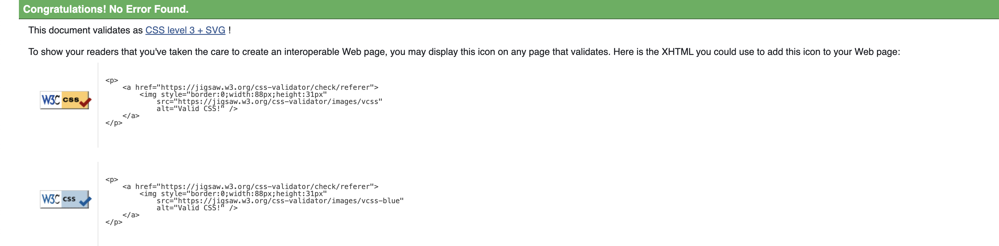
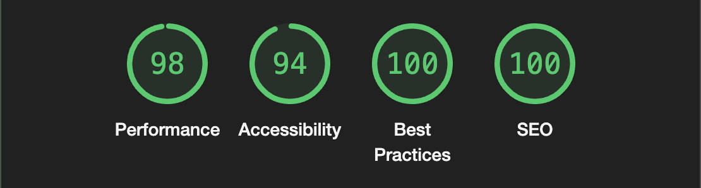

# Testing

Return to [README.md](README.md)

## Code Validation
All code written for the project has been validated. The final validation results can be seen below.

### W3C HTML Validation Results
All HTML code has been run through the [W3C HTML Validator](https://validator.w3.org/).

* During validation, a few problems were presented but after correcting the relevant issues, no warnings or errors were shown.

here are the errors and warnings presented:

1. Heading levels (warning)
This was fixed by rearranging heading levels on specific pages.

2. Navigation role in base template (warning)
This was fixed by removing the navigationr role as it was unnecessary.

3. Favicon link with alt (warning)
I fixed this by removing the alt tag as it was unnecessary.

4. Aria-describedby with no ids (error)
I removed the aria-describedby attributes to fix this error.

All pages presented the following message after final validation.

### W3C CSS Validation Results
All custom CSS code has been run through the [W3C CSS Validator](https://jigsaw.w3.org/css-validator/).

* No errors were presented for custom CSS.

### CI Python Linter Validation Results

These results are not done as there was not enough time for me to complete them. however, I will be sure to include them in the future.

## Responsiveness Testing
Tests were carried out throughout the development of the site using [Google Chrome Devtools](https://developer.chrome.com/docs/devtools/) to test responsiveness.

The testing produced suitable results across multiple devices. The site has been adapted to be used on small to large screen sizes (from mobile phones to laptops). I think there are improvements that could be made in the future when it comes to responsive design but I am pleased with the results at the current moment.

## Manual Testing
Throughout the development process, each user story was tested and developed using related acceptance criteria and tasks which can be found in the [kanbad board](https://github.com/users/Tony118g/projects/8).
To ensure correct functionality, I performed various extensive manual tests in relation to site goals and user stories. The site's resulting features are evidenced in the features section of the [readme](README.md) although a summary can be seen below for each epic. All tests proved successful except for email sending functionality on reservation booking and password resetting. I have included those as enhancements in future development and enhancement section in [readme](README.md)

These manual testing below were done on both chrome on desktop and iphone 13 pro max safari.

* ### Initial Django Setup
    * This was development related and all criteria was met.
    * Necessary packages were installed successfully.
    * Config variables were successfully secured.
    * The site was deployed successfully.

* ### Site Content Interaction
    * User authorization is handled throughout the site. Certain content is restricted to users depending on their role.
    * Different content and features are available depending on whether the user is:
        * Logged in or not.
        * Logged in as a customer.
        * Logged in as a staff member.
    * The relevant features and functionality for each user has been explained in the features section of the [readme](README.md).
    * If any user tries to access a page or feature that they are not authorized for, they are redirected and provided with a feedback message informing them of the restriction.
    * Any features that are not allowed for a certain user are not made available to them with the exception of the booking link which is available but will prompt users to login before booking.
    * If a user were to try access any features that they are not allowed to access, they would have to do it via the URL which makes the attempt very unlikely.
        * Even if a user were to use the URL to access a restricted feature, functionality is in place to prevent it from being fruitful.

* ### User Account Management
    * New users are able to fill in a form and register an account via a link in the navbar.
    * Once a user is registered, they can login and logout of the site as they please via links in the navbar which display a login form for logging in or a logout confirmation for logging out.
    * Registered users are able to view their profile page via a navbar link which contains information regarding their account details and reservations.
    * Registered users are also able to edit their account details by clicking on the available option in their profile page and filling in a form to do so.
    * Logged-in users are able to change their password via the link in the edit details page which will provide them with instructions to do so. If they follow the instructions, their password will be changed.
    * Registered users are able to delete their account and all related reservations by clicking on the available option in their profile page and confirming the deletion.

* ### User Reservation Management
    * Logged-in users are able to make a reservation request by filling in a form via a link in the navbar.
    * The status of reservations can be viewed in the user's profile page.
    * In the profile page, users can view all of their reservations. If they click edit on a reservation, the full details are displayed for them to view.
    * If a user wishes to edit a reservation, they may do so by filling in a form via the option to edit on each reservation. They cannot however edit any reservations that have passed. Once a reservation has been edited, a message provides the user with relevant feedback.
    * If a user wishes to cancel/delete a reservation they may do so via the delete button on each reservation. Once they confirm the deletion then the reservation is deleted and a message provides them with relevant feedback.

* ### Staff Reservation Management
    * Staff users have the ability to view all reservations in various ways.
        * They can view pending, approved, and denied reservations via link within the reservations section of the staff dashboard.
        * They can search for reservations on certain dates.
        * They can search for any reservations pertaining to a specific name.
    * Staff users can approve or deny reservations by clicking the options to do so in the reservations page or in a name search result if the resulting reservation is pending.
    * Staff can edit status of already approved or denied reservations by clicking on the edit button on reservation to change the status of the reservation. When they do a success message is shown.

* ### Staff Menu Management
    * Staff members can manage all aspects of the menu via the menu management section in the staff dashboard. In the menu management section, there are options to:
        * Add a menu item.
        * Manage menu items.
    * Staff users can add new menu items by filling in a form via a link in the staff dashboard.
    * The option to edit menu items is available to staff users via manage menu items link in menu section of the staff dashboard.
        * Once they fill in the relevant form and submit it, the menu item is updated.
    * The option to delete menu items is also available for each item. Once the option to delete an item is selected, the user is required to confirm the deletion. If the deletion is confirmed, the item is deleted.

* ### User Menu Interaction
    * All site users are able to view the menu via a link in the navbar.
    * Each menu item displays the title and price.
    * If a user clicks on a menu item then full details including an image of the item is displayed to the user.

### Lighthouse
I used the [Google lighthouse](https://developer.chrome.com/docs/lighthouse/overview/) test in Chrome Developer Tools to test pages on the site. This was used to test the following:

* Performance
* Accessibility
* Best Practices
* SEO

The results vary between pages and some pages could be improved upon. As I was mainly focusing on the functionality aspect of this site, I allowed less time for ensuring high-quality performance. Although the results are not to a very high standard, they are still acceptable, and the site functions and displays as intended.

Below is an example of the lighthouse results for the home page. Other page's results were slightly better or worse but were not majorly different.

### Review from friends and family
In addition to the above tests and procedures, the site was reviewed by my friends and family. This helped me get other people's opinions and receive real-world feedback. The feedback was mostly positive and helped confirm that the site met necessary standards.

Return to [README.md](README.md)
